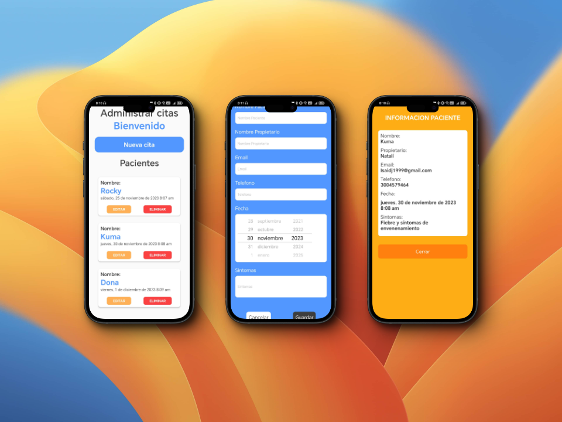

---

# CitaPeT - Aplicación de Gestión de Citas Veterinarias

## Descripción

CitaPet es una aplicación móvil desarrollada en React Native que simplifica la gestión de citas para clínicas veterinarias. Permite a los profesionales de la veterinaria y dueños de mascotas organizar fácilmente las citas, registrar información vital de las mascotas y mantener un seguimiento de los detalles importantes.

## Características Principales

- **Registro de Citas:**
  - Agenda fácilmente las citas de las mascotas con un sistema intuitivo de calendario.
  - Visualiza las citas pendientes y pasadas de un vistazo.

- **Perfil de Mascotas:**
  - Añade notas médicas.

- **Datos del Dueño:**
  - Almacena la información personal del dueño, como nombre, número de teléfono y dirección.

## Instalación

1. Clona este repositorio: `[git clone https://github.com/tuusuario/CITA-PET.git](https://github.com/isaidj/cita-pet.git)`
2. Instala las dependencias: `npm install`
3. Inicia la aplicación: `npm start`

## Requisitos del Sistema

- Node.js
- React Native CLI

## Contribuciones

¡Las contribuciones son bienvenidas! Si tienes ideas para mejorar CITA PET, por favor, abre un problema o envía una solicitud de extracción.

---

Espero que esto te ayude a empezar. ¡Si tienes alguna pregunta o algo más específico en mente, estaré encantado de ayudarte!
